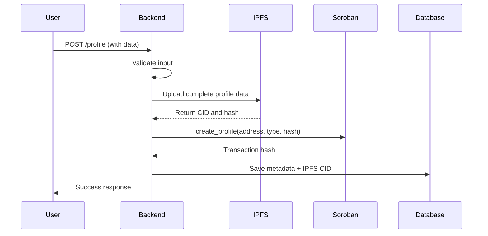
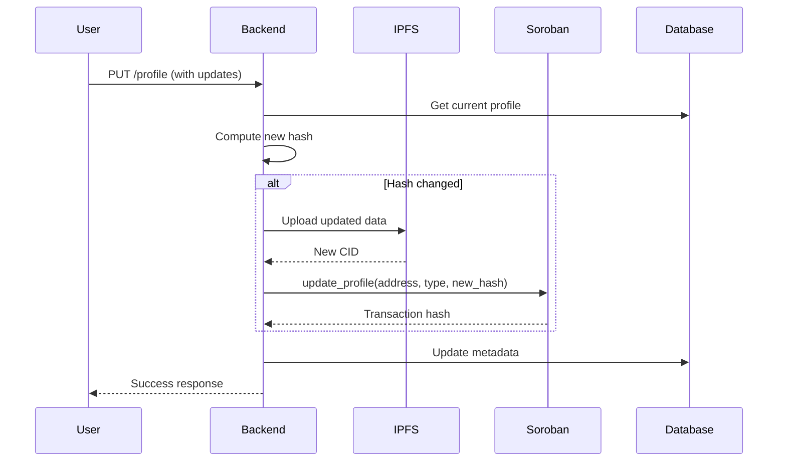
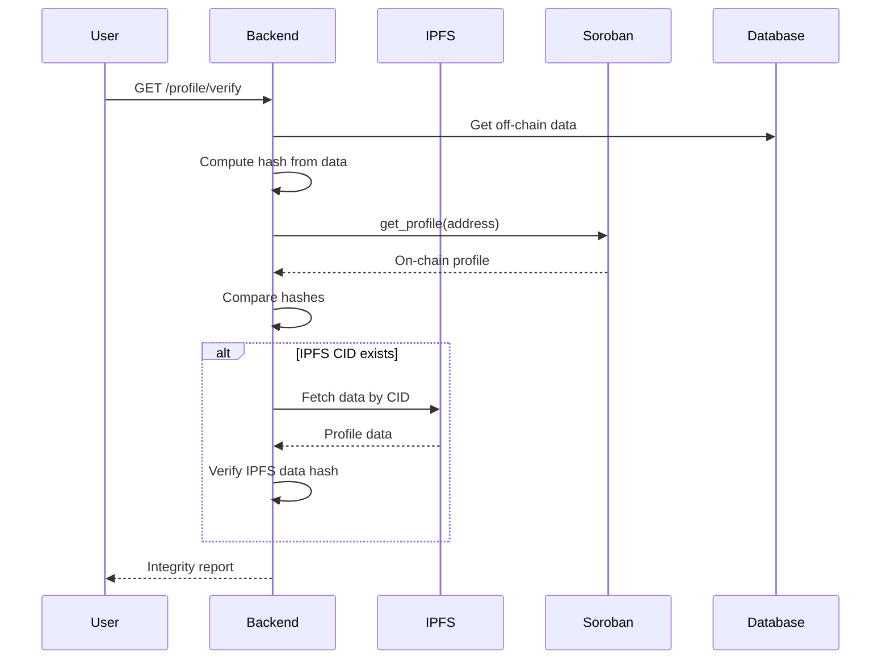

# On-Chain User Profile Implementation Guide

## Overview

This document describes the implementation of a minimal on-chain user profile structure using Stellar's Soroban smart contracts (SEP-29 compliant) to store essential user information while maintaining privacy and efficiency.

## Architecture

### Hybrid Storage Strategy

The implementation uses a hybrid approach combining on-chain and off-chain storage:

**On-Chain (Stellar Soroban Contract)**
- Minimal identity data
- Data integrity hash
- Account type and verification status
- Optimized for gas efficiency

**Off-Chain (PostgreSQL + IPFS)**
- Complete profile data
- Media files (avatars)
- Queryable metadata
- Cost-effective storage

## Data Structures

### On-Chain Profile (Soroban Contract)

```rust
pub struct UserProfile {
    pub owner: Address,           // Stellar public key (32 bytes)
    pub version: u32,              // Data structure version (4 bytes)
    pub account_type: AccountType, // Enum: Tenant/Landlord/Agent (1 byte)
    pub last_updated: u64,         // Unix timestamp (8 bytes)
    pub data_hash: Bytes,          // SHA-256 hash of complete profile (32 bytes)
    pub is_verified: bool,         // KYC/verification status (1 byte)
}
// Total: ~78 bytes on-chain
```

### Off-Chain Profile (PostgreSQL)

```typescript
interface ProfileMetadata {
  id: string;                    // UUID
  userId: string;                // Foreign key to users table
  walletAddress: string;         // Stellar address (56 chars)
  displayName: string | null;    // User's display name
  bio: string | null;            // Profile bio/description
  avatarUrl: string | null;      // Avatar image URL
  metadata: object | null;       // Additional JSON metadata
  dataHash: string;              // SHA-256 hash (matches on-chain)
  ipfsCid: string | null;        // IPFS content identifier
  lastSyncedAt: Date;            // Last sync timestamp
}
```

### IPFS Data Structure

```typescript
interface ProfileIpfsData {
  displayName: string | null;
  bio: string | null;
  avatarUrl: string | null;
  metadata: Record<string, unknown> | null;
  walletAddress: string;
  timestamp: number;
}
```

## Smart Contract Methods

### 1. Initialize Contract

```rust
pub fn init_profiles(env: Env, admin: Address)
```

Initializes the contract with an admin address. Can only be called once.

**Parameters:**
- `admin`: Address with verification privileges

### 2. Create Profile

```rust
pub fn create_profile(
    env: Env,
    owner: Address,
    account_type: AccountType,
    data_hash: Bytes,
) -> UserProfile
```

Creates a new on-chain profile.

**Parameters:**
- `owner`: User's Stellar address
- `account_type`: Tenant (0), Landlord (1), or Agent (2)
- `data_hash`: SHA-256 hash of complete profile data

**Returns:** Created `UserProfile`

**Authorization:** Requires signature from `owner`

### 3. Update Profile

```rust
pub fn update_profile(
    env: Env,
    owner: Address,
    account_type: Option<AccountType>,
    data_hash: Option<Bytes>,
) -> UserProfile
```

Updates an existing profile. Only provided fields are updated.

**Parameters:**
- `owner`: User's Stellar address
- `account_type`: Optional new account type
- `data_hash`: Optional new data hash

**Returns:** Updated `UserProfile`

**Authorization:** Requires signature from `owner`

### 4. Get Profile

```rust
pub fn get_profile(env: Env, owner: Address) -> Option<UserProfile>
```

Retrieves a user's profile.

**Parameters:**
- `owner`: User's Stellar address

**Returns:** `Some(UserProfile)` if exists, `None` otherwise

**Authorization:** Public read access

### 5. Verify Profile

```rust
pub fn verify_profile(
    env: Env,
    admin: Address,
    owner: Address,
) -> UserProfile
```

Marks a profile as verified (KYC completed).

**Parameters:**
- `admin`: Admin address
- `owner`: User's Stellar address to verify

**Returns:** Updated `UserProfile` with `is_verified = true`

**Authorization:** Requires admin signature

### 6. Check Profile Existence

```rust
pub fn has_profile(env: Env, owner: Address) -> bool
```

Checks if a profile exists for an address.

**Parameters:**
- `owner`: User's Stellar address

**Returns:** `true` if profile exists, `false` otherwise

## Implementation Flow

### Creating a Profile



### Updating a Profile



### Verifying Data Integrity



## Gas Optimization

### Storage Costs

| Operation | Estimated Gas | Notes |
|-----------|--------------|-------|
| Create Profile | ~50,000 | Initial storage allocation |
| Update Profile (hash only) | ~20,000 | Modify existing entry |
| Update Profile (type + hash) | ~25,000 | Multiple field updates |
| Get Profile | ~5,000 | Read operation |
| Verify Profile | ~15,000 | Admin operation |

### Optimization Strategies

1. **Minimal On-Chain Data**: Only 78 bytes stored per profile
2. **Optional Updates**: Only update changed fields
3. **Batch Operations**: Group multiple updates when possible
4. **Persistent Storage**: Use Soroban's persistent storage for long-lived data
5. **Hash Verification**: Off-chain data integrity without storing full data

## Security Considerations

### Data Validation

```typescript
// Backend validation before blockchain interaction
- Validate Stellar address format (56 chars, starts with 'G')
- Verify account type enum values (0-2)
- Ensure data hash is valid SHA-256 (64 hex chars)
- Rate limit profile updates (max 1 per minute)
- Sanitize all user inputs
```

### Access Control

```rust
// Smart contract authorization
- Profile creation: Requires owner signature
- Profile updates: Requires owner signature
- Profile verification: Requires admin signature
- Profile reads: Public access (no auth required)
```

### Data Integrity

1. **Hash Verification**: SHA-256 hash ensures data hasn't been tampered with
2. **IPFS Immutability**: Content-addressed storage prevents modification
3. **Timestamp Tracking**: `last_updated` field tracks all changes
4. **Version Control**: `version` field enables future schema migrations

## API Endpoints

### POST /profile
Create a new profile

**Request:**
```json
{
  "accountType": "tenant",
  "displayName": "John Doe",
  "bio": "Looking for a place to rent",
  "avatarUrl": "https://example.com/avatar.jpg",
  "metadata": {
    "preferences": {
      "notifications": true
    }
  }
}
```

**Response:**
```json
{
  "message": "Profile created successfully",
  "transactionHash": "abc123...",
  "dataHash": "def456...",
  "ipfsCid": "QmXyz...",
  "ipfsUrl": "https://gateway.pinata.cloud/ipfs/QmXyz..."
}
```

### PUT /profile
Update existing profile

**Request:**
```json
{
  "displayName": "Jane Doe",
  "accountType": "landlord"
}
```

**Response:**
```json
{
  "message": "Profile updated successfully",
  "transactionHash": "ghi789...",
  "onChainUpdated": true,
  "dataHash": "jkl012...",
  "ipfsCid": "QmAbc...",
  "ipfsUrl": "https://gateway.pinata.cloud/ipfs/QmAbc..."
}
```

### GET /profile
Get current user's profile

**Response:**
```json
{
  "walletAddress": "GBZXN7PIRZGNMHGA7MUUUF4GWPY5AYPV6LY4UV2GL6VJGIQRXFDNMADI",
  "onChain": {
    "owner": "GBZXN7PIRZGNMHGA7MUUUF4GWPY5AYPV6LY4UV2GL6VJGIQRXFDNMADI",
    "version": 1,
    "accountType": "tenant",
    "lastUpdated": 1640000000,
    "dataHash": "abc123...",
    "isVerified": false
  },
  "offChain": {
    "displayName": "John Doe",
    "bio": "Looking for a place to rent",
    "avatarUrl": "https://example.com/avatar.jpg",
    "metadata": { "preferences": { "notifications": true } },
    "dataHash": "abc123...",
    "ipfsCid": "QmXyz...",
    "ipfsUrl": "https://gateway.pinata.cloud/ipfs/QmXyz...",
    "lastSyncedAt": "2024-01-01T00:00:00Z"
  },
  "dataIntegrityValid": true
}
```

### GET /profile/wallet/:address
Get profile by wallet address (public)

**Response:** Same as GET /profile

### GET /profile/verify
Verify data integrity

**Response:**
```json
{
  "valid": true,
  "computedHash": "abc123...",
  "onChainHash": "abc123...",
  "message": "Data integrity verified: off-chain data matches on-chain hash"
}
```

## Testing

### Unit Tests

```bash
# Test smart contract
cd backend/src/blockchain/profile/contracts
cargo test

# Test backend services
cd backend
npm test -- profile
```

### Integration Tests

```typescript
describe('Profile Integration', () => {
  it('should create profile with IPFS upload', async () => {
    // Test full flow: API -> IPFS -> Soroban -> Database
  });

  it('should verify data integrity', async () => {
    // Test hash verification across all layers
  });

  it('should handle IPFS unavailability gracefully', async () => {
    // Test fallback when IPFS is down
  });
});
```

### Gas Usage Analysis

```bash
# Deploy contract to testnet
soroban contract deploy \
  --wasm target/wasm32-unknown-unknown/release/user_profile_contract.wasm \
  --source ADMIN_SECRET_KEY \
  --network testnet

# Measure gas for operations
soroban contract invoke \
  --id CONTRACT_ID \
  --source USER_SECRET_KEY \
  --network testnet \
  -- create_profile \
  --owner USER_PUBLIC_KEY \
  --account_type '{"Tenant":[]}' \
  --data_hash HASH_BYTES
```

## Deployment

### 1. Build Smart Contract

```bash
cd backend/src/blockchain/profile/contracts
cargo build --target wasm32-unknown-unknown --release
```

### 2. Optimize WASM

```bash
soroban contract optimize \
  --wasm target/wasm32-unknown-unknown/release/user_profile_contract.wasm
```

### 3. Deploy to Stellar

```bash
# Deploy to testnet
soroban contract deploy \
  --wasm target/wasm32-unknown-unknown/release/user_profile_contract.wasm \
  --source ADMIN_SECRET_KEY \
  --network testnet

# Initialize contract
soroban contract invoke \
  --id CONTRACT_ID \
  --source ADMIN_SECRET_KEY \
  --network testnet \
  -- init_profiles \
  --admin ADMIN_PUBLIC_KEY
```

### 4. Configure Backend

```env
# .env
STELLAR_NETWORK=testnet
STELLAR_HORIZON_URL=https://horizon-testnet.stellar.org
SOROBAN_RPC_URL=https://soroban-testnet.stellar.org
PROFILE_CONTRACT_ID=CXXXXXXXXXXXXXXXXXXXXXXXXXXXXXXXXXXXXXXXXXXXXXXXXXXXXXXX
PINATA_JWT=your_pinata_jwt_token
PINATA_GATEWAY=gateway.pinata.cloud
```

## Dependencies

```json
{
  "@stellar/stellar-sdk": "^12.2.0",  // Stellar SDK
  "pinata": "^2.5.3",                  // IPFS via Pinata
  "typeorm": "^0.3.28",                // Database ORM
  "@nestjs/typeorm": "^11.0.0"         // NestJS TypeORM integration
}
```

```toml
[dependencies]
soroban-sdk = "21.0.0"  # Soroban smart contract SDK
```

## Acceptance Criteria

✅ On-chain profile structure implemented in Soroban
✅ Smart contract methods for CRUD operations
✅ Integration with IPFS for off-chain storage
✅ PostgreSQL entities for queryable data
✅ Data integrity verification system
✅ Comprehensive API endpoints
✅ Unit tests for smart contract
✅ Integration tests for full flow
✅ Gas optimization report
✅ Security considerations documented
✅ Deployment guide provided

## Future Enhancements

1. **Profile Recovery**: Multi-sig recovery mechanism
2. **Profile Delegation**: Allow agents to manage profiles
3. **Profile History**: Track all profile changes on-chain
4. **Batch Operations**: Create/update multiple profiles in one transaction
5. **Profile Search**: Off-chain indexing for profile discovery
6. **NFT Integration**: Link profile to Stellar NFTs
7. **Reputation System**: On-chain reputation scores

## References

- [Stellar Documentation](https://developers.stellar.org/)
- [Soroban Smart Contracts](https://soroban.stellar.org/)
- [SEP-29: Account Memo Requirements](https://github.com/stellar/stellar-protocol/blob/master/ecosystem/sep-0029.md)
- [IPFS Documentation](https://docs.ipfs.tech/)
- [Pinata IPFS Service](https://docs.pinata.cloud/)
