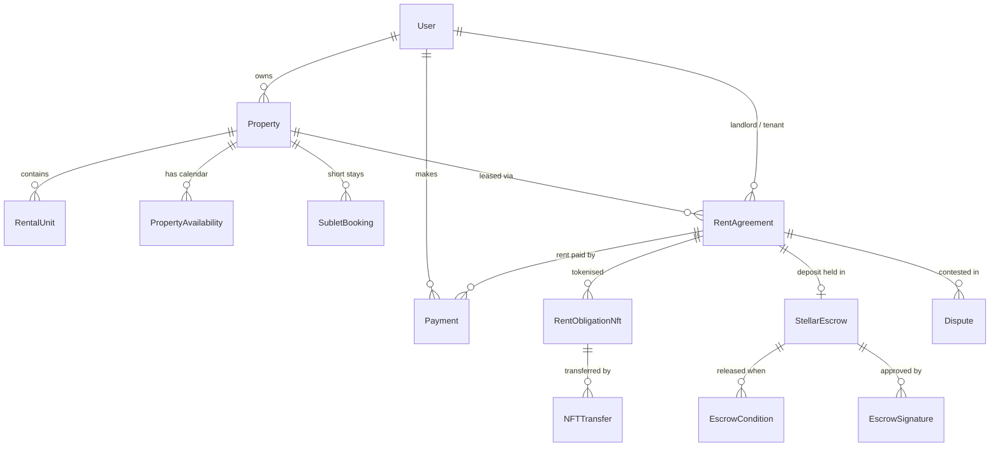

# Data Model

The full entity-relationship diagram is generated from TypeORM decorators into [`data-model.er.mmd`](data-model.er.mmd) (Mermaid). Regenerate after changing any `*.entity.ts`:

```bash
cd backend && npm run docs:er
```

The generator (`backend/scripts/generate-er-diagram.mjs`) captures `@ManyToOne`, `@OneToOne` and `@ManyToMany`; the inverse `@OneToMany` sides are implied. Entities that link only by id columns (no decorator) appear unconnected.

## Core domain



## Aggregates and lifecycles

### Property (`properties`)

Owned by a landlord `User`; composed of images, amenities, `RentalUnit`s and availability. `rentalMode` (`long_term`, `short_term`, `hybrid`, `flexible`) decides whether it is leased through agreements, booked as sublets, or both.

`ListingStatus`: `draft` → `published` → `rented` → (`published` again when the lease ends) → `archived`.
Drafts are autosaved in `PropertyListingDraft` before publishing.

### Rent agreement (`rent_agreements`, entity `RentAgreement`)

The lease between landlord and tenant for a property; the root for rent payments, NFTs, escrow and disputes. Mirrored on-chain by the Chioma Soroban contract.

`AgreementStatus`: `draft` → `pending_deposit` → `signed` → `active` → `expired` | `terminated`. Any active agreement can move to `disputed`, and returns to `active` or `terminated` when the `Dispute` resolves.

### Booking (`sublet_bookings`)

Short-term stays against a property's availability calendar, governed by the property's `CancellationPolicy`. A booking reserves dates, is paid through the payments module, and releases the dates when cancelled.

### Payment (`payments`)

A money movement by a `User`, optionally tied to an agreement and a saved `PaymentMethod`; recurring rent is driven by `PaymentSchedule`. Fiat goes through Paystack/Flutterwave; crypto through Stellar (`AnchorTransaction`, `IndexedTransaction`).

`PaymentStatus`: `pending` → `completed` | `failed`; `completed` → `refunded` | `partial_refund`.

### Escrow (`stellar_escrows`)

Holds the security deposit between source and destination `StellarAccount`s with an optional arbiter. Release requires its `EscrowCondition`s to be met and enough `EscrowSignature`s.

`EscrowStatus`: `PENDING` → `FUNDED` → `ACTIVE` → `RELEASED` | `REFUNDED`. `ACTIVE` → `DISPUTED` → `RELEASED` | `REFUNDED`. Unfunded escrows end `EXPIRED` or `CANCELLED`.

### Rent obligation NFT (`rent_obligation_nfts`)

A tokenised claim on an agreement's future rent, minted on-chain. Ownership changes are logged in `NFTTransfer`; rent is routed to the current holder.

### Dispute

Opened against a `RentAgreement` (usually over the escrowed deposit); arbiters vote (`MIN_VOTES_REQUIRED`) and the outcome drives the escrow's release or refund.
